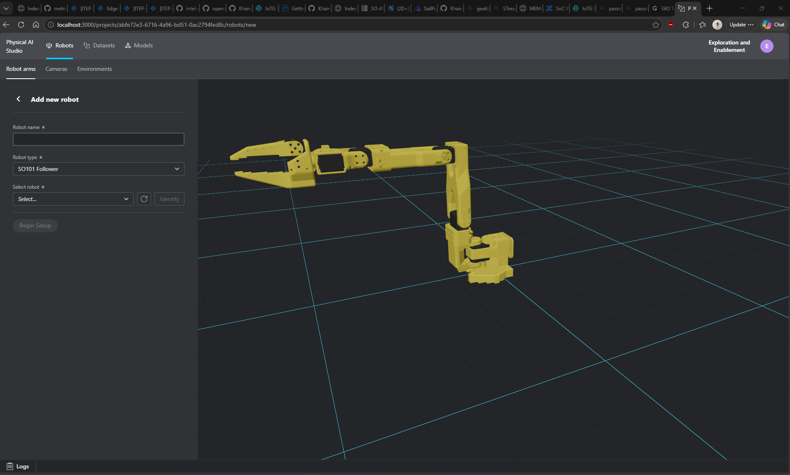

# Physical AI Studio Exploration — Intel Panther Lake Platform
**Date:** 2026-07-03  
**Platform:** Intel Core Ultra 5 335 (Panther Lake) | 64 GB DDR5-6400 | iGPU (XPU) + NPU  
**OS:** Linux 6.17-intel | PyTorch 2.10.0+xpu | Lightning 2.6.5

> **Related repo:** For inference/benchmarking only, see
> [openvinotoolkit/physicalai](https://github.com/KhairulIzwan/physicalai/blob/exploration/panther-lake-benchmark/EXPLORATION.md)

## 0. Quick Preview



Initial UI bring-up on this platform.

---

## 1. What is Physical AI Studio?

End-to-end framework for teaching robots via imitation learning:
- **Record** human demonstrations
- **Train** policies (ACT, Pi0, Pi0.5, GR00T, SmolVLA, full LeRobot zoo)
- **Export** to OpenVINO / ONNX / Torch for deployment
- **Deploy** via the companion `physicalai` runtime

```
physical-ai-studio/
├── library/      ← ML training (PyTorch + Lightning + LeRobot)  ← we work here
└── application/  ← GUI backend + frontend (Docker-based)
```

---

## 2. Environment Setup

Physical AI Studio uses `uv` for dependency management (separate from physicalai's pip venv).

Install `uv` first (one-time):

```bash
curl -LsSf https://astral.sh/uv/install.sh | sh

# If uv is not found in the current shell
source "$HOME/.local/bin/env"
```

```bash
# Clone
git clone https://github.com/open-edge-platform/physical-ai-studio.git
cd physical-ai-studio/library

# Install with XPU support (auto-detected on Panther Lake)
uv sync --extra xpu

# Or CPU-only
uv sync --extra cpu

# Run any command in the environment
uv run python script.py
uv run physicalai <subcommand>
```

### What uv auto-detected on Panther Lake
When running `uv sync --extra cpu`, uv detected the Intel iGPU and **automatically switched to PyTorch XPU** (`torch==2.10.0+xpu`). This means training will use the integrated GPU natively via Intel Extension for PyTorch.

### Installed packages (key ones)
| Package | Version | Notes |
|---|---|---|
| PyTorch | 2.10.0+**xpu** | Intel iGPU acceleration — auto-detected |
| Lightning | 2.6.5 | Distributed training, mixed precision |
| LeRobot | ≥0.5.1 | HuggingFace robotics dataset/policy framework |
| physicalai | 0.1.2.dev15 | Runtime inference (included as dependency) |
| OpenVINO | ≥2026.0 | Export target |
| ONNX | — | Export target |

---

## 3. Verify Installation

```bash
cd /home/user/physical-ai-studio/library
uv run python -c "
import torch, lightning
from physicalai.inference import InferenceModel
from physicalai.policies.act.policy import ACT
from physicalai.policies.pi05.policy import Pi05

print('PyTorch  :', torch.__version__)
print('Lightning:', lightning.__version__)
print('XPU      :', torch.xpu.is_available())
if torch.xpu.is_available():
    print('XPU dev  :', torch.xpu.get_device_name(0))
print('ACT      : OK')
print('Pi05     : OK')
"
```

Expected output on Panther Lake:
```
PyTorch  : 2.10.0+xpu
Lightning: 2.6.5
XPU      : True
XPU dev  : Intel(R) Graphics [0xb090]
ACT      : OK
Pi05     : OK
```

---

## 4. Environment vs physicalai Runtime

| Feature | `physicalai/.venv` | `physical-ai-studio/library/.venv` |
|---|---|---|
| Activate | `source physicalai/.venv/bin/activate` | `cd physical-ai-studio/library && uv run ...` |
| Inference | ✅ | ✅ (physicalai included) |
| Training | ❌ | ✅ |
| PyTorch | ❌ | ✅ 2.10.0+xpu |
| Lightning | ❌ | ✅ |
| LeRobot | ❌ | ✅ |
| `benchmark.py` | ✅ | ✅ via `uv run python ../../physicalai/benchmark.py` |

**Use `physicalai/.venv`** when: running `benchmark.py`, deploying on robot  
**Use `physical-ai-studio` uv env** when: training, fine-tuning, exporting models

---

## 5. Available CLI Commands

```bash
cd /home/user/physical-ai-studio/library

# See all physicalai subcommands (training, export, etc.)
uv run physicalai --help
uv run pai --help

# List available policies
uv run python -c "
from physicalai.policies.act.policy import ACT
from physicalai.policies.pi05.policy import Pi05
print('Available: ACT, Pi05')
"
```

---


Two services need to be started — backend and UI in separate terminals.

### Prerequisites (system libs, one-time)
```bash
sudo apt-get install -y ffmpeg libgl1 libglib2.0-0 libusb-1.0-0 libusb-1.0-0-dev \
  libclang-dev pkg-config build-essential g++
```

### Also required (one-time)
```bash
# From physical-ai-studio root (if you're currently in library/, run: cd ..)

# Node.js v24
curl -fsSL https://deb.nodesource.com/setup_24.x | sudo -E bash -
sudo apt-get install -y nodejs

# UI dependencies
cd /home/user/physical-ai-studio/application/ui && npm install

# Ensure uv is available in this shell
source "$HOME/.local/bin/env"

# Backend dependencies
cd /home/user/physical-ai-studio/application/backend && uv sync --extra xpu  # or --extra cpu
```

### Start Backend (Terminal 1)
```bash
cd /home/user/physical-ai-studio/application/backend
uv run ./run.sh
# Runs at http://localhost:7860
```

### Start UI (Terminal 2)
```bash
cd /home/user/physical-ai-studio/application/ui
npm start
# Runs at http://localhost:3000
```

Open **http://localhost:3000** in browser.

### First Run Output (confirmed working)
- Backend: DB migrations applied (20 migration steps), workers started (ModelWorker, TrainingWorker, DatasetImportWorker)
- UI: React app built in 3.71s via Rsbuild v2.0.15
- Framework: FastAPI 0.138.0 | uvicorn | SQLite DB

### Note on npm warnings
- `npm install` may print deprecation warnings for transitive dependencies and `allow-scripts` review prompts.
- These are non-blocking for current setup when install finishes successfully and `npm run build` passes.
- Keep dependencies updated over time, but do not treat these warnings as immediate setup failures.

### Available UI Workflows
1. Create a project
2. Set up robot + camera hardware
3. Record demonstration datasets
4. Train policies (ACT, Pi0.5, etc.)
5. Export to OpenVINO / ONNX
6. Deploy via `physicalai` runtime

---

## 6. Simulation vs Real Robot

Short answer: **both are supported**.

- You can do substantial development in simulation only (train, benchmark, export).
- You need a real robot only for hardware data collection and final on-robot validation/deployment.

### Simulation-first workflow (recommended first)

```bash
cd /home/user/physical-ai-studio/library

# 1) Train on sim demonstrations
uv run physicalai fit \
  --model physicalai.policies.ACT \
  --data physicalai.data.LeRobotDataModule \
  --data.repo_id lerobot/aloha_sim_transfer_cube_human \
  --trainer.max_epochs 10

# 2) Benchmark in simulation (LIBERO)
uv run physicalai benchmark \
  --benchmark physicalai.benchmark.gyms.LiberoBenchmark \
  --benchmark.task_suite libero_10 \
  --benchmark.num_episodes 20 \
  --policy physicalai.policies.ACT \
  --ckpt_path experiments/lightning_logs/version_0/checkpoints/last.ckpt

# 3) Export for deployment testing
uv run python -c "
from physicalai.policies import ACT
policy = ACT.load_from_checkpoint('experiments/lightning_logs/version_0/checkpoints/last.ckpt')
policy.export('./policy_export', backend='openvino')
print('Exported to ./policy_export')
"
```

### Real-robot workflow (when hardware is ready)

- Start with the same policy/export pipeline as simulation.
- Connect robot + camera, then use the Studio app (`application/backend` + `application/ui`) for project setup and dataset recording.
- Run inference/control loop on real observations and perform safety-limited validation first.

Practical sequence:
1. Validate policy behavior in simulation.
2. Export model and verify inference latency on target hardware.
3. Connect robot/camera and test short, low-speed episodes.
4. Scale up only after stable success and safety checks.

## 7. Next Steps / TODO

- [ ] Train ACT policy on LIBERO simulation dataset
- [ ] Export trained model to OpenVINO IR format
- [ ] Benchmark exported model with `physicalai/benchmark.py`
- [ ] Compare trained model latency vs pre-trained `OpenVINO/act-fp16-ov`
- [ ] Try XPU-accelerated training (PyTorch XPU already detected)
